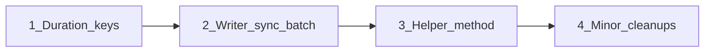

# Protocol System Refinements

## Files to modify

- [`reagentic/protocol/observer.py`](reagentic/protocol/observer.py) - fix duration keys, add helper method
- [`reagentic/protocol/writer.py`](reagentic/protocol/writer.py) - add sync batch write method
- [`reagentic/protocol/storage/sqlite.py`](reagentic/protocol/storage/sqlite.py) - fix type hint
- [`reagentic/protocol/storage/jsonlines.py`](reagentic/protocol/storage/jsonlines.py) - add docstring

---

## 1. Fix duration tracking for multiple LLM/tool calls

**Problem:** If an agent makes multiple LLM calls within one `run_id`, each `llm_start` overwrites the previous timestamp, resulting in incorrect `duration_ms`.

**Solution:** Use a call counter to generate unique keys for each LLM call pair:

```python
# observer.py
from itertools import count

class ProtocolObserver(RunHooks, TracingProcessor):
    def __init__(self, ...) -> None:
        ...
        self._call_counter = count()

    async def on_llm_start(self, context, agent, system_prompt, input_items) -> None:
        entry = self._extractor.extract_llm_start(agent, system_prompt, input_items, context)
        run_id = self._get_run_id(context, agent)
        call_id = next(self._call_counter)
        self._start_times[f"llm:{run_id}:{call_id}"] = (entry.timestamp, call_id)
        entry.metadata = {"_call_id": call_id}  # Store for matching in on_llm_end
        await self._writer.write(entry)
```

Alternative simpler approach - store call_id in entry.metadata and match by most recent:

```python
# Store timestamp with entry id for exact matching
self._start_times[f"llm:{entry.id}"] = entry.timestamp
```

This is cleaner since each entry already has a unique UUID.

---

## 2. Add sync batch write to ProtocolWriter

**Problem:** `observer._flush_sync_queue()` directly accesses `_writer._storage`, breaking encapsulation.

**Solution:** Add a public sync method to `ProtocolWriter`:

```python
# writer.py
def write_batch_sync(self, entries: List[ProtocolEntry]) -> None:
    """Synchronous batch write, bypasses buffer for sync queue flush."""
    if not entries:
        return
    try:
        asyncio.run(self._storage.write_batch(entries))
    except Exception as e:
        logger.error(f"Failed to write batch sync: {e}")
```

Update observer to use it:

```python
# observer.py
def _flush_sync_queue(self) -> None:
    with self._sync_lock:
        if not self._sync_queue:
            return
        entries = self._sync_queue.copy()
        self._sync_queue.clear()
    self._writer.write_batch_sync(entries)
```

---

## 3. Extract helper method for run_id

**Problem:** `getattr(context, "run_id", None) or id(agent)` repeated 8 times.

**Solution:** Add helper method:

```python
# observer.py
def _get_run_id(self, context: Any, agent: Any) -> str:
    return str(getattr(context, "run_id", None) or id(agent))
```

Replace all occurrences.

---

## 4. Minor cleanups

**a) Fix type hint inconsistency in sqlite.py:**

```python
# Change line 130
params: list[Optional[str]] = []
# To
params: List[Optional[str]] = []
```

**b) Add type hints for context parameters in observer.py:**

```python
async def on_agent_start(self, context: Any, agent: Any) -> None:
```

**c) Add docstring to JSONLines close():**

```python
def close(self) -> None:
    """No-op: JSONLines uses file handles opened per-write, no cleanup needed."""
    pass
```

---

## Implementation order



All changes are independent and low-risk.