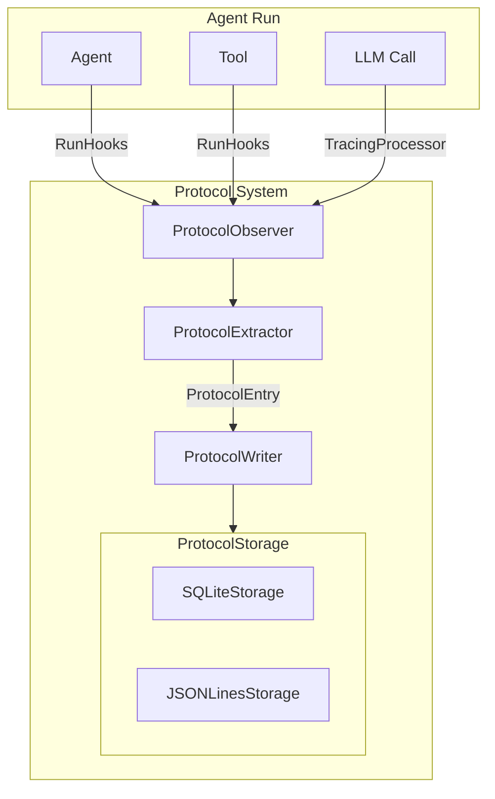

# Система протоколирования для Reagentic Framework

## Архитектура



## Структура файлов

```
reagentic/protocol/
├── __init__.py           # Публичный API
├── models.py             # Pydantic модели: ProtocolEntry, ProtocolConfig
├── extractor.py          # ProtocolExtractor - извлечение данных из объектов
├── observer.py           # ProtocolObserver - реализует RunHooks + TracingProcessor
├── writer.py             # ProtocolWriter - запись в storage
└── storage/
    ├── __init__.py
    ├── base.py           # ProtocolStorage (ABC)
    ├── sqlite.py         # SQLiteProtocolStorage
    └── jsonlines.py      # JSONLinesProtocolStorage
```

## 1. Модели данных ([`reagentic/protocol/models.py`](reagentic/protocol/models.py))

```python
class ProtocolEventType(Enum):
    AGENT_START = "agent_start"
    AGENT_END = "agent_end"
    LLM_START = "llm_start"
    LLM_END = "llm_end"
    TOOL_START = "tool_start"
    TOOL_END = "tool_end"
    HANDOFF = "handoff"
    TRACE_START = "trace_start"
    TRACE_END = "trace_end"
    SPAN_START = "span_start"
    SPAN_END = "span_end"

class ProtocolDetailLevel(Enum):
    MINIMAL = "minimal"    # agent, tool, input/output, time
    STANDARD = "standard"  # + tokens, prompts, reasoning, handoffs
    FULL = "full"          # + intermediate steps, all metadata

class ProtocolEntry(BaseModel):
    id: str                           # UUID
    timestamp: datetime
    event_type: ProtocolEventType
    session_id: Optional[str]         # Группировка записей
    
    # Контекст
    agent_name: Optional[str]
    agent_id: Optional[str]
    tool_name: Optional[str]
    
    # Данные (зависят от уровня детализации)
    input_data: Optional[Any]
    output_data: Optional[Any]
    system_prompt: Optional[str]      # standard+
    tokens_used: Optional[int]        # standard+
    duration_ms: Optional[float]
    
    # Расширенные данные (full)
    intermediate_steps: Optional[List[Any]]
    trace_id: Optional[str]
    span_id: Optional[str]
    metadata: Optional[Dict[str, Any]]
    error: Optional[str]

class ProtocolConfig(BaseModel):
    detail_level: ProtocolDetailLevel = ProtocolDetailLevel.STANDARD
    include_input: bool = True
    include_output: bool = True
    include_prompts: bool = True
    include_intermediate: bool = False
    max_content_length: Optional[int] = None  # Truncate long content
```

## 2. ProtocolExtractor ([`reagentic/protocol/extractor.py`](reagentic/protocol/extractor.py))

Извлекает данные из объектов Agent, Tool, Span и создает ProtocolEntry:

```python
class ProtocolExtractor:
    def __init__(self, config: ProtocolConfig): ...
    
    def extract_agent_start(self, agent: Agent, context: Any) -> ProtocolEntry: ...
    def extract_agent_end(self, agent: Agent, output: Any) -> ProtocolEntry: ...
    def extract_llm_start(self, agent: Agent, prompt: str, input_items: list) -> ProtocolEntry: ...
    def extract_llm_end(self, agent: Agent, response: ModelResponse) -> ProtocolEntry: ...
    def extract_tool_start(self, agent: Agent, tool: Tool) -> ProtocolEntry: ...
    def extract_tool_end(self, agent: Agent, tool: Tool, result: str) -> ProtocolEntry: ...
    def extract_handoff(self, from_agent: Agent, to_agent: Agent) -> ProtocolEntry: ...
    def extract_span(self, span: Span, is_start: bool) -> ProtocolEntry: ...
```

## 3. ProtocolObserver ([`reagentic/protocol/observer.py`](reagentic/protocol/observer.py))

Реализует `RunHooks` и `TracingProcessor` для перехвата всех событий:

```python
class ProtocolObserver(RunHooks, TracingProcessor):
    def __init__(self, extractor: ProtocolExtractor, writer: ProtocolWriter): ...
    
    # RunHooks implementation
    async def on_agent_start(self, context, agent): ...
    async def on_agent_end(self, context, agent, output): ...
    async def on_llm_start(self, context, agent, prompt, input_items): ...
    async def on_llm_end(self, context, agent, response): ...
    async def on_tool_start(self, context, agent, tool): ...
    async def on_tool_end(self, context, agent, tool, result): ...
    async def on_handoff(self, context, from_agent, to_agent): ...
    
    # TracingProcessor implementation
    def on_trace_start(self, trace): ...
    def on_trace_end(self, trace): ...
    def on_span_start(self, span): ...
    def on_span_end(self, span): ...
    def shutdown(self): ...
    def force_flush(self): ...
```

## 4. ProtocolStorage ([`reagentic/protocol/storage/`](reagentic/protocol/storage/))

Абстрактный интерфейс и две реализации:

```python
# base.py
class ProtocolStorage(ABC):
    @abstractmethod
    async def write(self, entry: ProtocolEntry) -> None: ...
    @abstractmethod
    async def write_batch(self, entries: List[ProtocolEntry]) -> None: ...
    @abstractmethod
    async def read(self, session_id: str) -> List[ProtocolEntry]: ...
    @abstractmethod
    async def query(self, filters: Dict) -> List[ProtocolEntry]: ...
    @abstractmethod
    def close(self) -> None: ...

# sqlite.py - SQLite с одним файлом
class SQLiteProtocolStorage(ProtocolStorage):
    def __init__(self, db_path: str = "protocol.db"): ...

# jsonlines.py - JSONLines формат
class JSONLinesProtocolStorage(ProtocolStorage):
    def __init__(self, file_path: str = "protocol.jsonl"): ...
```

## 5. ProtocolWriter ([`reagentic/protocol/writer.py`](reagentic/protocol/writer.py))

Буферизированная запись с async поддержкой:

```python
class ProtocolWriter:
    def __init__(self, storage: ProtocolStorage, buffer_size: int = 100): ...
    async def write(self, entry: ProtocolEntry) -> None: ...
    async def flush(self) -> None: ...
    def close(self) -> None: ...
```

## 6. Интеграция и использование

```python
# Пример использования
from reagentic.protocol import (
    ProtocolObserver, ProtocolExtractor, ProtocolWriter,
    ProtocolConfig, ProtocolDetailLevel,
    SQLiteProtocolStorage, JSONLinesProtocolStorage
)
from agents import Agent, Runner

# Настройка протокола
config = ProtocolConfig(detail_level=ProtocolDetailLevel.STANDARD)
storage = SQLiteProtocolStorage("agent_protocol.db")
writer = ProtocolWriter(storage)
extractor = ProtocolExtractor(config)
observer = ProtocolObserver(extractor, writer)

# Подключение к агенту
agent = Agent(name="Assistant", ...)
result = Runner.run_sync(
    agent, 
    "Hello",
    hooks=observer  # Подключаем как RunHooks
)

# Для TracingProcessor:
from agents import add_trace_processor
add_trace_processor(observer)
```

## Ключевые особенности

1. **Гибкая экстракция**: `ProtocolExtractor` изолирует логику извлечения данных - легко изменить что записывается
2. **Конфигурируемая детализация**: три уровня (minimal/standard/full) + точечная настройка
3. **Два хранилища**: SQLite для запросов, JSONLines для простоты и стриминга
4. **Буферизация**: `ProtocolWriter` накапливает записи для эффективной пакетной записи
5. **Async-совместимость**: все методы записи async
6. **Без вендоринга**: использует официальные механизмы расширения SDK